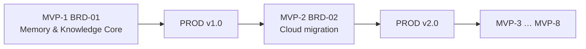

# Engramory — Project Roadmap

*This file is the **single canonical roadmap** — cycle scope + sequencing (MVP-1..8) + the engineering Phase view (0–3). Prior `docs/ROADMAP.md` was consolidated here 2026-07-08 per PLAN-003 §5.5 Wave 3 (see `DECISIONS.md` E-0001).*

*Cycles follow the framework cadence: **MVP → PROD → new-feature MVP → new PROD**. Each cycle is anchored by a **BRD set** — a platform BRD plus its feature BRDs, linked by `@depends:` (see [HOW_TO_USE_THE_FRAMEWORK](../docs/HOW_TO_USE_THE_FRAMEWORK.md) §4). The current cycle's BRD set is authored at full depth (8 layers); future cycles are **draft BRD sketches** (business scope only) until their cycle begins.*

*Last updated: 2026-07-09*

---

## Vision

Engramory is the aidoc-flow ecosystem's shared memory & knowledge plane — per-agent, distilled, portable — that all projects build on and that replaces `ucx_kb`.

**Guiding strategy** ([../docs/STRATEGY.md](../docs/STRATEGY.md)): build the plane (Postgres spine, ports, gateway, scope, governance); **adopt** a proven memory engine behind `MemoryPort` rather than hand-writing distillation; and lead with an evaluation + feedback loop. MVP-1 carries a vertical slice (one agent, one real workload) plus that eval harness; later cycles stay sketches until the slice proves value.

## Current status (2026-07-09)

**Phase 0 — dev foundation.** Scaffold + full-depth MVP-1 SDD artifacts in place. As of 2026-07-11 (PLAN-002 / ADR-10): the SPEC-01 tool set is complete over AccessSurface, and agents reach it through the **`engramory` CLI dev/CI face** (SPEC-07) with install + agent-usage docs and a reference Skill; `make smoke` verifies the full memory loop on the compose store. The MCP gateway (production face) is still a stub.

**Architecture decisions locked** (`../sdd/05_ADR/`): ADR-05 own the canonical store · ADR-07 scope ladder (`agent/project/domain/space` + `tenant_id`) · ADR-08 single platform, two bounded cores · ADR-09 independent memory storage (the iplan ledger is integrated as an *episode source*, not a backend). Concept validated in [`../docs/research/MEMORY_CONCEPT_REVIEW.md`](../docs/research/MEMORY_CONCEPT_REVIEW.md); build direction in [`../docs/STRATEGY.md`](../docs/STRATEGY.md).

**Next (MVP-1):** the vertical slice — Postgres memory repository (done) + one adopted `MemoryPort` engine (Mem0, replacing the interim reflect pass) + `memory_add`/`memory_search` over MCP (the production face; the CLI face already serves dev/CI per ADR-10) — with the evaluation harness (now scriptable via the CLI) and the retrieval→outcome feedback loop (recording shipped 2026-07-11; the SPEC-04 confidence rule consuming it is open) built in parallel. Then the learning-half work (confidence dynamics, contradiction handling, memory safety) and the ledger→episode ingestion adapter (ADR-09). The eval harness + feedback loop are MVP-1 exit criteria, not stretch goals.

**Known issue (CI, operations-owned):** the shared `trust` gate fails on
every PR here — `ai-review.yml@ci/v1.4.3` fetches the trust allowlist from
the **private** `aidoc-flow-operations`, and this **public** repo's default
token cannot read it. PRs currently require admin-merge. **Fix (decided
2026-07-09, see `TODO.md` §1):** founder sets the `AI_REVIEW_TOKEN` repo
secret (Option A). Moving the trust config to a public location is an
upstream `aidoc-flow-ci` follow-up, not yet available in any tagged canon
version.

## Engineering Phase view (Phase 0–3)

The MVP cycles above map to a 4-phase engineering-view:
**Phase 0–2 ≈ MVP-1** (self-hosted memory & knowledge core);
**Phase 3 ≈ MVP-2** (cloud migration). Phases 0–2 are entirely
free/self-hosted; Phase 3 is an adapter swap, not a rewrite.

| Phase | Goal | Key work | Outcome |
|---|---|---|---|
| **0 — Dev foundation** | Cheap self-hosted base | `docker compose up`: Postgres+pgvector, Redis, MinIO, LiteLLM+Ollama, Neo4j, Keycloak. Define all Ports. Apply memory schema. | Free local platform, portable by construction |
| **1 — Consolidate** | One platform | Fold RAC's MCP tools/parsers onto the core; RAC becomes the per-project domain-config layer (Trading = one example project); everything behind Ports | RAC + Nexus v3 merged, no stack duplication |
| **2 — Cognition** | The differentiator | `agent_id` scoping; reflection + consolidation workers; wire a MemoryPort adapter (LangMem/Cipher/Mem0) | Per-agent distilled, endless memory |
| **3 — Cloud migration** | GCP or Azure | Swap adapters (managed Postgres, Redis, object store, model endpoint, secrets, identity); IaC; pg_dump + object copy; re-embed if model changes | Same app, cloud-native, data intact |

See [`../docs/ARCHITECTURE.md`](../docs/ARCHITECTURE.md) for the full
design and the portability matrix.

## Cycle cadence

Each BRD set = one iteration cycle. New scope = a new BRD set; cross-cycle traceability via `@depends: BRD-01`.

## Cycle plan

| Cycle | BRD | Status | Goal | Depth | Depends |
|---|---|---|---|---|---|
| **MVP-1** | BRD-01 | **Full (8 layers)** | Memory & Knowledge Core: L0–L3, distillation, shared access, ucx_kb replacement, portability foundation | All layers authored | — |
| MVP-2 | BRD-02 | Draft sketch | Cloud migration & managed operations (GCP/Azure adapters, managed Postgres/graph/models, IaC) | Scope only | BRD-01 |
| MVP-3 | BRD-03 | Draft sketch | Advanced distillation & learning (confidence scoring, drift, smarter reflection/consolidation) | Scope only | BRD-01 |
| MVP-4 | BRD-04 | Draft sketch | Domain & project configuration: two-tier config + inheritance, `domain` scope, domain-shared vs project-scoped memory | Scope only | BRD-01 |
| MVP-5 | BRD-05 | Draft sketch | Multi-tenancy, security & compliance hardening (SSO/RBAC, residency/CMEK, audit, SOC 2-ready) | Scope only | BRD-01 |
| MVP-6 | BRD-06 | Draft sketch | Observability & operations (dashboards, SLOs, alerting, provenance/audit browser, runbooks) | Scope only | BRD-01 |
| MVP-7 | BRD-07 | Draft sketch | Brain portability & migration tooling (export/import, cross-engine migration, re-embed automation) | Scope only | BRD-01 |
| MVP-8 | BRD-08 | Draft sketch | Multi-project operations & tuning: onboarding runbooks, isolation/quotas, instance tuning, shared-vs-dedicated topology | Scope only | BRD-01, BRD-04 |

## Sequencing notes

- **MVP-1 → PROD** before MVP-2: prove the shared per-agent memory plane + ucx_kb parity on the self-hosted stack first.
- **MVP-2 (cloud)** is sequenced early because the portability promise (BRD-01) is only realized once a managed cloud adapter set exists; pull it earlier/later per business need.
- MVP-3 (advanced distillation) and MVP-4 (domain & project configuration) deliver the differentiated value; order by which consumer project needs it first.
- MVP-5/6 (security/compliance, observability) harden for enterprise/regulated consumers (e.g., BeeLocal).
- MVP-8 (multi-project operations & tuning) depends on MVP-4 and on multi-project demand maturing; can move earlier if a consumer's multi-project topology requires it.

## Rules

- Only the current cycle's BRD is authored at full depth. A sketch graduates to a full BRD (PRD→IPLAN) when its cycle starts.
- A sketch carries **business scope only** — no PRD/EARS/BDD/ADR/SPEC/TDD/IPLAN content (that would be over-authoring).
- Re-prioritize by editing this roadmap + the `BRD-00_index.md` Planned-BRDs table; keep `@depends:` links intact.
