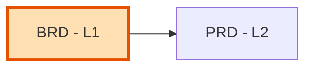

# BRD-00: Business Requirements Document Index

Master index of all Business Requirements Documents for **Engramory** (the
aidoc-flow ecosystem's memory & knowledge plane).

---

## Position in Document Workflow

**Layer**: 1 (Business Requirements Layer)
**Downstream**: PRD (Layer 2)
**Traceability chain**: BRD → PRD → EARS → BDD → ADR → SPEC → TDD → IPLAN → Code

---

## Document Registry

Cycle 1 (BRD-01) is authored at **full depth** (8 layers). BRD-02…BRD-08 are
**draft sketches** (business scope only — downstream layers authored when their
MVP cycle begins). See [../../roadmap/ROADMAP.md](../../roadmap/ROADMAP.md).

| BRD ID | Module | Type | Status | Depth | Location |
|--------|--------|------|--------|-------|----------|
| BRD-01 | Memory & Knowledge Core | Platform | Draft | Full (8 layers) | [BRD-01_platform_engramory_core.yaml](BRD-01_platform_engramory_core.yaml) |
| BRD-02 | Cloud Migration & Managed Operations | Feature | Draft sketch | Scope only | [BRD-02_cloud_migration.yaml](BRD-02_cloud_migration.yaml) |
| BRD-03 | Advanced Distillation & Learning | Feature | Draft sketch | Scope only | [BRD-03_advanced_distillation.yaml](BRD-03_advanced_distillation.yaml) |
| BRD-04 | Domain & Project Configuration | Feature | Draft sketch | Scope only | [BRD-04_domain_project_config.yaml](BRD-04_domain_project_config.yaml) |
| BRD-05 | Multi-Tenancy, Security & Compliance Hardening | Feature | Draft sketch | Scope only | [BRD-05_security_compliance.yaml](BRD-05_security_compliance.yaml) |
| BRD-06 | Observability & Operations | Feature | Draft sketch | Scope only | [BRD-06_observability_ops.yaml](BRD-06_observability_ops.yaml) |
| BRD-07 | Brain Portability & Migration Tooling | Feature | Draft sketch | Scope only | [BRD-07_brain_portability_tooling.yaml](BRD-07_brain_portability_tooling.yaml) |
| BRD-08 | Multi-Project Operations & Tuning | Feature | Draft sketch | Scope only | [BRD-08_multi_project_ops.yaml](BRD-08_multi_project_ops.yaml) |

---

## Module Categories

| ID | Module Name | BRD | Status |
|----|-------------|-----|--------|
| M1 | Memory & Knowledge Core (L0–L3 + distillation, MCP, ucx_kb replacement) | BRD-01 | Full |
| M2 | Cloud & operations (migration, observability, security/compliance) | BRD-02, BRD-05, BRD-06 | Sketch |
| M3 | Cognition & portability (advanced distillation, brain migration tooling) | BRD-03, BRD-07 | Sketch |
| M4 | Multi-project & configuration (domain/project config, multi-project ops) | BRD-04, BRD-08 | Sketch |

---

## Out of Engramory scope (consumer-owned)

| Concern | Owner | Note |
|---------|-------|------|
| Pay-memory / wallet audit (Privy/x402/AP2) | Consumer project (e.g., BeeLocal SDD) | Project-specific; **not an Engramory BRD**. Consumes Engramory's generic provenance/audit memory. Keeps Engramory domain-agnostic. |

---

## Allocation Rules

- **Numbering**: sequential from `01`; numbers stable; per-layer independent.
- **Current cycle**: author BRD-01 in full; future BRDs stubbed above.
- **Filename**: platform BRDs `BRD-NN_platform_{slug}.yaml`; feature BRDs `BRD-NN_{slug}.yaml`.

---

## Quick Links

- **PRD Layer**: [../02_PRD](../02_PRD/)
- **Framework guide**: [../../docs/HOW_TO_USE_THE_FRAMEWORK.md](../../docs/HOW_TO_USE_THE_FRAMEWORK.md)

---

*Last Updated: 2026-06-22*
